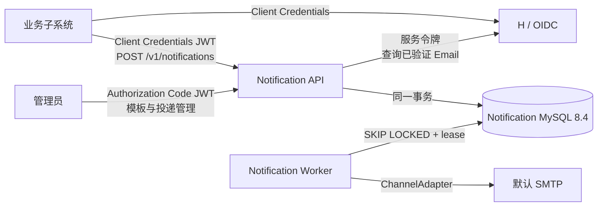
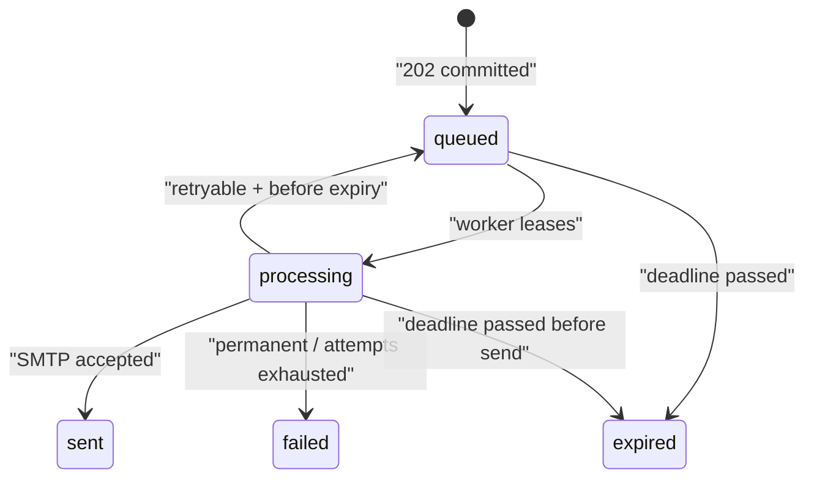

# 统一通知服务技术设计

## 1. 架构结论

采用两个独立仓库、三个运行进程：



- `h` 是身份、机器授权和用户已验证主邮箱的权威来源。
- `notification-service` 是模板、通知、投递状态、重试与渠道配置的权威来源。
- Notification API 与 Worker 在同一仓库、同一镜像中，以不同启动命令常驻运行并独立扩缩容。
- 服务间只共享 OpenAPI 契约和 JWT 约定，不引用对方的 TypeScript 源码。

这个边界把复杂性封装在通知服务内部。业务方只看到“提交一次通知意图、按 ID 查询状态”两个主要能力；模板版本、内容选择、加密、队列、重试和 SMTP 都是实现细节。

## 2. 模块边界

### H

1. `AuthorizationServer`
   - 为获准的 confidential 子应用签发短期机器 JWT。
   - 为管理员签发面向通知管理 API 的用户 JWT。
   - 发布 JWKS，支持当前和上一把验证公钥的轮换窗口。
2. `EmailOwnership`
   - 管理注册、改邮箱的 OTP 挑战及真实邮箱验证状态。
   - OIDC `email_verified` 与 Contact API 都读取这一事实来源。
3. `NotificationContact`
   - 仅向持有正确 audience/scope 的通知服务返回用户的已验证当前主邮箱。

### notification-service

1. `NotificationAcceptance`（深模块）
   - 认证、授权、幂等、限流、模板/变量校验、收件人解析、版本固定、加密持久化和 `202` 响应。
2. `TemplateCatalog`
   - 草稿编辑、发布校验、不可变版本、locale 内容、应用授权和审计。
3. `DeliveryQueue`
   - 数据库任务领取、租约、恢复、过期判断、重试计划和终态。
4. `ContentRenderer`
   - 受限语法、自动转义、变量 schema、HTML 清理和资源上限。
5. `ChannelRouter`
   - 首版固定选择平台默认 Email；以后加入用户偏好时保持受理契约不变。
6. `ChannelAdapter`
   - 真实端口，输入为已渲染且与能力匹配的内容；首版有 `SmtpEmailAdapter` 和测试替身。
7. `PayloadVault`
   - 对收件地址、变量快照和渲染内容执行带密钥版本的认证加密及清理。

## 3. 认证与权限

### 3.1 资源与 scope

| audience | 主体 | 最小 scope | 用途 |
|---|---|---|---|
| `notification-api` | 业务子应用 | `notifications:send`, `notifications:read` | 提交通知、读取本应用通知 |
| `h-internal` | notification-service | `users:contact:read` | 查询已验证通知地址 |
| `notification-admin` | H 管理员用户 | `templates:read/write/publish`, `template-grants:write`, `deliveries:read` | 管理模板与审计 |

- 机器 access token 建议 TTL 5 分钟，JWT 使用 RS256；每个 API 必须校验 `iss`、`aud`、`exp`、`client_id` 和 scope。
- H 持久化每个子应用允许的 resource/scope；申请值不能超出白名单。
- 业务 API 的 `appId` 一律取可信 token 的 `client_id`，禁止请求体指定。
- 管理员 token 使用用户 `sub` 记录实际操作者，不能用共享管理员 client 代替人身份。

### 3.2 H Contact API

`GET /internal/v1/users/{userId}/notification-contacts/email`

成功：

```json
{
  "userId": "123",
  "channel": "email",
  "address": "user@example.com",
  "verifiedAt": "2026-08-10T08:00:00Z"
}
```

- 用户不存在或没有已验证主邮箱时统一返回 `404 notification_contact_unavailable`，避免暴露更细的账号状态。
- H 暂时不可用返回 `5xx`；Notification API 映射为可重试 `503 dependency_unavailable`，不落通知、不返回 `202`。
- Notification API 取得地址后立即作为本次通知的加密快照保存；后续改邮箱不改变已受理任务。

## 4. 业务调用契约

### 4.1 提交通知

`POST /v1/notifications`

```json
{
  "templateKey": "blog.comment.reply",
  "recipient": { "kind": "user", "userId": "123" },
  "variables": {
    "commenterName": "Alice",
    "postTitle": "...",
    "replyUrl": "https://example.com/..."
  },
  "locale": "zh-CN",
  "expiresAt": "2026-08-11T08:00:00Z",
  "idempotencyKey": "comment-reply:987"
}
```

注册前等受限场景可使用：

```json
{
  "templateKey": "account.email.verify",
  "recipient": {
    "kind": "address",
    "channel": "email",
    "address": "pending@example.com"
  },
  "variables": { "code": "123456" },
  "idempotencyKey": "email-verification-challenge:uuid"
}
```

成功受理：

```json
{
  "notificationId": "uuid",
  "status": "queued",
  "acceptedAt": "2026-08-10T08:00:01Z"
}
```

语义：

- `202` 只在认证、应用/模板授权、幂等、限流、变量、期限、收件地址解析全部通过，且通知与投递任务在一个数据库事务中提交后返回。
- `(appId, idempotencyKey)` 唯一。服务保存规范化请求摘要：同键同摘要返回原结果；同键不同摘要返回 `409 idempotency_conflict`。
- 幂等命中在限流之前处理，不重复计费或占用配额。
- `recipient.kind=address` 只允许模板显式标记的事务型直接地址能力；首版仅允许 Email。
- 调用者可缩短模板期限，不能超过模板版本声明的最大 TTL。

### 4.2 状态读取

`GET /v1/notifications/{notificationId}` 返回 `queued | processing | sent | failed | expired`、尝试次数和脱敏错误类别。业务 token 只能读取同一 `client_id` 创建的通知；管理员需 `deliveries:read`。首版不提供取消、批量查询和投递 webhook。

### 4.3 错误类别

| HTTP | code | 调用方行为 |
|---|---|---|
| 400 | `invalid_request` / `invalid_variables` | 修正请求，不重试 |
| 401/403 | `invalid_token` / `insufficient_scope` / `template_forbidden` | 修正认证或授权 |
| 404 | `template_not_found` / `notification_not_found` | 不重试 |
| 409 | `idempotency_conflict` | 使用新键或修正调用错误 |
| 422 | `recipient_unavailable` / `content_unavailable` | 业务处理，不盲目重试 |
| 429 | `rate_limited` | 遵守 `Retry-After` |
| 503 | `dependency_unavailable` | 使用同一幂等键退避重试 |

## 5. 模板模型与内容选择

### 5.1 生命周期

- `Template`：稳定 key、名称、状态、是否允许直接地址、默认 locale、默认/最大 TTL。
- `TemplateDraft`：可编辑工作副本。
- `TemplateVersion`：发布后不可变，包含变量 JSON Schema、敏感字段声明及所有 locale 内容。
- `TemplateContent`：`version + locale` 下保存 `subject`、必需的 `text/plain`、可选的 `text/html`。
- `TemplateAppGrant`：显式允许哪个 `appId` 使用哪个模板。

发布时原子生成新版本并校验：至少一个默认 locale、每个 locale 有 subject 与纯文本、变量引用都在 schema 中、HTML 已清理、URL 协议安全、内容和循环上限合法。已排队通知固定 `templateVersionId`。

### 5.2 渠道能力协商

`ChannelAdapter` 声明能力，例如：

```ts
interface ChannelCapabilities {
  channel: 'email' | 'sms' | string;
  contentTypes: readonly ('text/plain' | 'text/html')[];
  supportsProviderIdempotency: boolean;
}
```

路由与渲染规则：

- Email 且模板有 HTML：渲染 subject、纯文本、HTML，SMTP 发送 `multipart/alternative`。
- Email 无 HTML：只发纯文本。
- 未来短信等纯文本渠道：只渲染 `text/plain`。
- 不运行时做 HTML → 纯文本转换；缺少渠道必需内容时终止为配置错误，并在发布阶段尽量提前阻止。
- 请求 locale 不存在时使用版本默认 locale并记录 fallback 指标；首版只要求默认语言内容。

模板引擎只提供自动转义插值与有上限的条件/循环，禁止任意 JavaScript、运行时 helper 和 raw HTML 变量。敏感变量从日志、普通审计和错误详情中排除。

## 6. 数据与状态

### 6.1 notification-service 核心表

| 表 | 关键字段/约束 |
|---|---|
| `notifications` | UUID、app_id、idempotency_key、request_hash、template_version_id、locale、recipient_kind、encrypted_payload、key_version、status、expires_at；唯一 `(app_id,idempotency_key)` |
| `delivery_tasks` | notification_id、status、next_attempt_at、attempt_count、lease_owner、lease_expires_at、last_error_class；按待领取条件建复合索引 |
| `delivery_attempts` | task_id、attempt_no、started/finished_at、result、provider_message_id、脱敏错误；唯一 `(task_id,attempt_no)` |
| `templates` / `template_drafts` | 稳定元数据与可编辑草稿 |
| `template_versions` / `template_contents` | 不可变发布快照及 locale 内容 |
| `template_app_grants` | 唯一 `(template_id,app_id)` |
| `admin_audit_logs` | actor_sub、action、entity、摘要，不含敏感正文 |

模板 schema 与非敏感模板正文可以明文存储；收件地址、通知变量及渲染快照属于加密载荷。终态 24 小时后清除载荷，非内容投递元数据保留 30 天。

### 6.2 状态机



`sent` 表示 SMTP 服务端接受，不代表用户收件箱最终收到。Worker 在领取后及实际调用适配器前都检查 `expiresAt`。

### 6.3 MySQL 8.4 队列

每轮 Worker 在短事务中使用 `SELECT ... FOR UPDATE SKIP LOCKED` 领取一小批到期任务，写入唯一 `lease_owner`、`lease_expires_at` 和 `processing` 后提交，再在事务外发送。完成后以 `taskId + lease_owner` 条件更新结果，防止过期 Worker 覆盖新租约。

恢复扫描把租约过期的 `processing` 任务重新放回 `queued`。SMTP 超时发生在“是否已接受”未知窗口时仍重试，因此整体是至少一次，可能出现极低概率重复邮件。

## 7. 重试、限流与可观测性

- SMTP 4xx、连接超时和瞬时网络错误可重试；无效地址、模板/渲染错误及 SMTP 明确 5xx 为永久失败。具体分类由适配器返回结构化结果。
- 模板版本定义 TTL 与重试策略档位：验证码建议 10 分钟、短退避；评论通知建议 24 小时、较长退避。调用方不能自定义任意重试参数。
- 受理层限制 app、template、recipient digest 的速率；Worker 限制 SMTP 全局并发和突发。地址摘要使用带服务端密钥的 HMAC，避免可枚举哈希。
- 指标至少包含受理结果、限流、队列深度、最老任务年龄、租约恢复、重试/失败分类、受理到首次尝试、受理到 SMTP 接受、locale fallback、清理任务滞后。
- 日志以 `notificationId/appId/templateVersionId` 关联，不写完整地址、变量、正文、OTP 或 SMTP 密钥。

## 8. 两条端到端流程

### 邮箱验证码

1. H 创建注册/改邮箱挑战，生成随机码，只保存摘要、过期、次数和冷却信息。
2. H 用自身 confidential client 获取 `notification-api` token。
3. H 以直接地址、验证码模板和 challenge ID 幂等键请求通知。
4. 通知服务固定模板版本并排队；Worker 通过 SMTP 发送。
5. 用户把验证码提交给 H；H 校验并在事务中消费挑战、创建用户或替换主邮箱及写入验证时间。
6. 通知服务从不校验验证码，也不能重新生成验证码。

### 博客回复/评论

1. 博客系统提交统一 `userId`、模板变量和评论事件 ID 幂等键。
2. Notification API 用服务令牌同步查询 H Contact API，取得已验证 Email 快照。
3. 通知与投递任务提交后返回 `202`；博客请求不等待 SMTP。
4. Worker 选择模板默认 locale，渲染纯文本/HTML 并交给 SMTP 适配器。
5. 博客系统可按 `notificationId` 查询脱敏状态；首版没有 webhook。

## 9. 部署与密钥

- Notification API 和 Worker 共享镜像，但使用 `start:api`、`start:worker` 两个命令；分别设置健康检查、资源和副本数。
- MySQL 8.4 为独立实例/库；不要求先升级现有业务 MySQL 5.7.44。
- SMTP 主机、端口、用户名、密码、From、TLS 策略与载荷主密钥来自部署 secret。数据库只保存密钥版本，不保存主密钥。
- 轮换载荷密钥时，新写入使用新版本，Worker 在过渡期能读取仍保留载荷所需的旧版本。

## 10. 兼容、上线与回滚

1. 先在 H 增加邮箱验证字段、历史数据迁移及真实 OIDC claim，不切业务通知。
2. 增加 OAuth resource/scope 白名单和 Client Credentials，先只授权 notification-service 与一个试点调用方。
3. 部署通知服务 DB、API、Worker，用测试 SMTP/沙箱完成契约和恢复测试。
4. 创建并发布验证码、博客评论模板，配置应用授权与限流。
5. 单一子系统灰度；观察队列年龄、失败率、重复率和 H Contact API 延迟，再逐步迁移。

回滚时先停止新调用或撤销应用 scope，再让 Worker 排空已受理任务；不能直接回滚数据库状态导致已受理通知丢失。模板版本不可变，因此可以撤销当前发布指针并恢复到上一版本，而不修改已排队记录。

## 11. 首版明确不做

- 用户渠道实例、用户偏好、分类策略、多渠道 fan-out/fallback。
- Email 以外的生产适配器、附件、抄送/密送、批量收件人、定时发送、营销退订。
- 管理 UI、用户配置 UI、投递结果 webhook、取消通知。
- Kafka/RabbitMQ/Redis 队列和自动 HTML 转纯文本。
