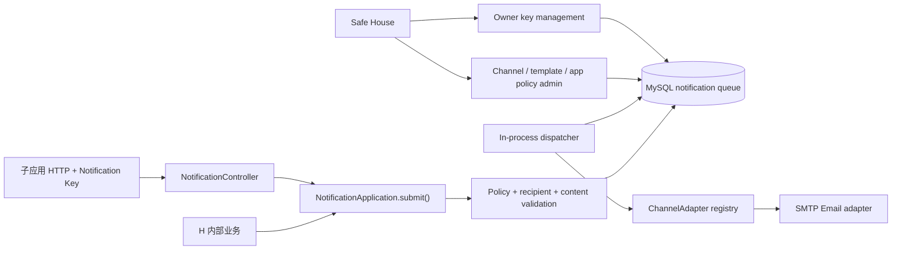

# H 内置轻量化消息通知服务设计

## 1. Architecture and module seam

`NotificationModule` 是 deep module。调用方只学习受理与查询 interface；目标解析、权限、模板渲染、加密持久化、幂等、多人拆分、重试和渠道选择隐藏在 implementation 内。



主要 interface：

```ts
type SubmitNotificationCommand = {
  caller: { kind: 'internal'; name: string } | { kind: 'subapp'; appId: string };
  recipients: Array<{ kind: 'user'; userId: number } | { kind: 'email'; email: string }>;
  content:
    | { kind: 'template'; templateKey: string; variables: Record<string, string> }
    | { kind: 'content'; subject: string; text: string; html?: string };
  idempotencyKey?: string;
};

interface NotificationApplication {
  submit(command: SubmitNotificationCommand): Promise<{ notificationId: string }>;
  status(caller: NotificationCaller, id: string): Promise<NotificationStatusProjection>;
}
```

真实内部 seams：`ChannelAdapter` 有 SMTP 与测试 adapter；`Clock` 有生产与 fake clock，供 retry/lease/retention 测试。Controller 保持薄；外部 controller 验证 Key 后构造同一 caller context。

## 2. Persistence model

所有新表使用显式稳定名称与 TypeORM migration。

| Table | Important fields / constraints |
|---|---|
| `notification_channel_configs` | `channel_type` PK (`email`), enabled, SMTP host/port/TLS/user, encrypted password envelope, from name/address, updated_by, timestamps |
| `notification_templates` | UUID/id, immutable unique key, name, enabled, subject/text/html, JSON allowed_variables, updated_by, timestamps |
| `subapp_notification_policies` | app_id PK/FK, direct_content, manual_recipient, updated_by, timestamps |
| `notification_template_grants` | unique `(app_id, template_id)`, FK cascade |
| `notification_api_keys` | id, app_id, keyed digest, hint, enabled, created_by, last_used_at, timestamps; no plaintext |
| `notifications` | UUID, caller kind/app/internal name, optional idempotency key, request hash, channel, encrypted subject/text/html, aggregate status/counts, payload purge time, timestamps |
| `notification_deliveries` | UUID, notification_id, encrypted recipient, recipient digest, status, attempts, next attempt, lease owner/expiry, error class, sent/purge timestamps |

内容快照在 notification 保存一次；每个 delivery 只保存独立地址。所有验证完成后，用单事务插入 root 与全部 deliveries。

Key 明文格式为 `hnt_<id>_<random>`。持久层只保存 keyed HMAC digest 与 hint；验证时按 ID 定位一行、计算 digest 并恒定时间比较。轮换创建新 Key，不覆盖旧 secret。

## 3. HTTP contracts

### External

- `POST /v1/notifications`：Notification Key guard，受理并返回 `{ notificationId }`。
- `GET /v1/notifications/:id`：同一 guard，查询条件包含应用所有权。
- Header：`Authorization: NotificationKey <plaintext>`，避免与用户 JWT Bearer 混淆。现有全局 guard 对无角色/权限 metadata 的 route 放行，由专用 guard 完成认证。

```json
{
  "recipients": [
    { "kind": "user", "userId": 42 },
    { "kind": "email", "email": "guest@example.com" }
  ],
  "content": {
    "kind": "template",
    "templateKey": "account.verify-email",
    "variables": { "code": "123456" }
  },
  "idempotencyKey": "verify-email:challenge-id"
}
```

状态 projection 只含汇总状态、total/sent/failed/pending、时间与脱敏 error-class counts。

### Management

- SMTP：`GET/PUT /v1/notification-admin/channels/email`。
- Templates：`GET/POST /v1/notification-admin/templates`、`GET/PUT /:id`、`PUT /:id/enabled`。
- App policy：`GET/PUT /v1/notification-admin/apps/:appId/policy`（含 template IDs）。
- Owner Keys：`GET/POST /v1/apps/:appId/notification-keys`、`PUT /:keyId/enabled`、`DELETE /:keyId`，复用现有 app owner check。

渠道、模板与应用策略使用分离 permission code；Key 生命周期使用现有子应用管理权限并由 service 校验 owner。

稳定错误分类包含 invalid/disabled key、insufficient capability、template missing/disabled/forbidden、invalid variables/recipient、too many recipients、rate limited、idempotency conflict、channel unavailable、notification not found。

## 4. Content processing

- 模板只支持 `{{variable}}` 插值，不支持代码、helper、条件或循环。
- 保存时解析 subject/text/html 引用，拒绝未声明变量与语法错误；调用时拒绝缺失或额外变量。
- Subject/text 使用纯字符串插值；HTML 变量先转义，最终 HTML 使用明确的事务邮件 allowlist 清理。直接 HTML 使用同一 sanitizer。
- Safe House 首期只编辑 HTML 源码，不使用未清理 `v-html` 预览。
- 集中限制：subject 255 chars、text 100 KB、HTML 200 KB、变量最多 50 个、单变量 10 KB。

## 5. Acceptance flow

1. 认证 caller，读取应用当前 policy。
2. 校验 DTO 与 capability。
3. 解析全部 user、规范化 Email、去重；任一失败则整体拒绝。
4. 去重后限制 20 人；渲染、转义、清理内容。
5. 对 caller、排序后的收件集合、内容和 channel 计算 canonical request hash。
6. 可选 idempotency：相同 hash 返回原 ID，不同 hash 冲突。
7. Redis 对 request 与 recipient 分别限流。
8. 加密并在单事务插入 notification/deliveries。

Redis key 只含 app/internal caller ID。Redis 不可用时外部受理 fail closed，防止绕过限流；管理读取不受影响。

## 6. Dispatcher

MySQL 5.7 不依赖 `SKIP LOCKED`，使用 compare-and-set lease：

1. 查询一小批到期 pending 或 lease 过期 processing IDs。
2. 对候选逐个原子 UPDATE，写唯一 worker token 与 lease expiry；仅 `affected=1` 者领取成功。
3. 成功者解密并调用 adapter。
4. 成功标 `sent`；可重试错误增加 attempt 并排期；永久/耗尽错误标 `failed`。
5. 每次终态转换后从子项权威状态重算 root counts/status。

退避约为 1m、5m、30m、2h，最多 5 次或 24h。SMTP 4xx/瞬时网络错误重试；无效地址和明确永久 SMTP 5xx 失败。渠道禁用时保留任务，重新启用后恢复，超过 24h 失败。

## 7. Encryption and retention

- 使用通知专用 AES-256-GCM key (`NOTIFICATION_SECRET_KEY` + version)，避免跨领域密文替换。
- AAD：`notification-channel:email`、`notification-content:<id>`、`notification-recipient:<id>`。
- 清理先将终态超过 24h 的 envelope columns 置空，再删除超过 7d 的 root/children；删除后幂等窗口结束。
- 新写入永远使用当前 key version；轮换期间可读取旧版本。仍有活动密文引用时不得移除旧 key。

## 8. Safe House module map

遵循 Vue 3 Composition API、typed props/emits、API module 与 composable 分层：

| Module | Responsibility / interface |
|---|---|
| `user-manage.vue` | 薄 route composition surface，组合三个管理区 |
| `notification-channel-form.vue` | SMTP 本地 draft/form validation，只 emit save |
| `notification-template-list.vue` | 列表/空态/loading 与 create/edit events |
| `notification-template-form.vue` | typed create/edit modal，emit submitted draft |
| `app-notification-policy.vue` | 选择 app、grants 与 capability switches，emit save |
| `useNotificationAdmin.ts` | 管理数据与显式 channel/template/policy actions |
| existing app detail extension | Owner Key list/create/toggle/delete，一次性明文 dialog |
| `useNotificationKeys.ts` | owner-scoped Key lifecycle |
| `api/notification.ts`, `types/notification.ts` | 完整 typed transport interface |

Props down，typed events up。Password/Key plaintext 只放局部临时状态，关闭 dialog 后清除，不进入 Pinia/localStorage。

## 9. Rollout and rollback

1. 上线可逆 migrations 和 backend contracts，SMTP/dispatcher 默认关闭。
2. 上线 Safe House，配置加密 SMTP 与模板。
3. 给单个试点 app 只授予模板，使用 sandbox SMTP 验证。
4. 启用 dispatcher，观察 queue age、attempt/error 和 rate limits。
5. 只向审查过的 app 开放 direct/manual capabilities。

回滚先停止新外部受理与 dispatcher，保留队列和 encryption keys。只有任务排空/明确清除且 migration preflight 确认不静默丢数据后，才允许回退 schema。
